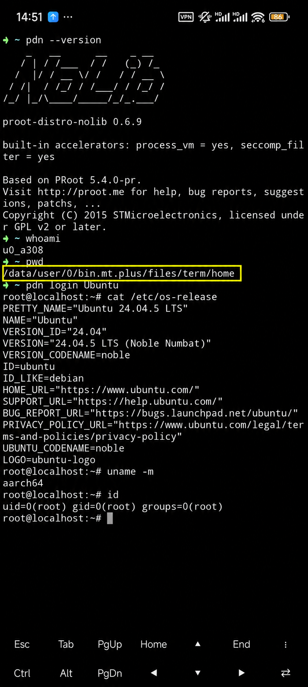

# proot-distro-nolib

简体中文 | [English](README.en.md)

当前本地 ELF 与 AAR：**v0.6.12 · ARM64 Android · 早期测试版**。支持安装别名和稳定实例元数据；此前 syscall 修复与接入验收结果见[测试记录](docs/pdn-error-testing.md)。发布附件见 [GitHub Releases](https://github.com/EMERLADD/proot-distro-nolib/releases)。

## 目录

- [0. 这是什么？](#0-这是什么)
- [1. 运行条件与权限](#1-运行条件与权限)
- [2. 下载与更新](#2-下载与更新)
- [3. 快速开始](#3-快速开始)
- [4. 已验证的使用场景](#4-已验证的使用场景)
- [5. 文档导航](#5-文档导航)
- [6. 构建与贡献](#6-构建与贡献)
- [7. 来源与许可证](#7-来源与许可证)
- [8. 常见问题](#8-常见问题)
- [9. 现有局限](#9-现有局限)

## 0. 这是什么？

**PDN 是基于 [pr](https://github.com/oonid/pr) 的独立 Android Linux 发行版管理工具。** 它把 PRoot 引擎、下载、校验、解压和发行版管理整合进一个 ARM64 Android 程序，让 Android 设备运行 Linux 环境，无需额外安装 Termux，也不需要宿主提供 Bash、Python、curl 或 tar。

<p align="center">
  
</p>

**实机演示：从 MT 管理器进入 Ubuntu。** 图中使用 MT 管理器内置终端模拟器，宿主是普通 App 权限下的 Android Shell；黄色框标出了 MT 私有目录 `/data/user/0/bin.mt.plus/files/term/home`。执行 `pdn login Ubuntu` 后进入 Ubuntu 24.04 LTS（ARM64）。Linux 中的 `root` 是 PRoot 模拟身份，不代表 Android 已取得 root；这条运行路径不需要 Termux 或 Shizuku。截图保留当时的版本号，见[未经标注的原图](docs/images/mt-ubuntu-original.jpg)。

**启动轻快**：同一份 Alpine ARM64 归档，在清空环境变量、使用新 HOME 的 Termux 中，PDN 启动耗时约 **35 ms**，proot-distro 约 **269 ms**。

| 干净环境下的启动入口 | 中位耗时 |
| --- | --- |
| Termux + proot-distro | **269 ms** |
| 同样的 Termux + PDN | **35 ms** |
| Android shell + PDN | **41 ms** |

按各自默认登录配置，计时至首条命令执行并退出；不含 rish 连接、下载或安装。Termux 清理对照各统计 20 次，Android shell 统计 40 次。[完整测速与范围](docs/pdn-error-testing.md#066-alpine-启动耗时对比)。

- **直接管理 Linux**：安装、登录、执行命令、挂载项目目录、保存配置、备份恢复和卸载。
- **可供其他 APK 调用**：提供 AAR 和直接打包 `.so` 两种接入方式，适合工作区、AI 前端或其他需要 Linux 执行能力的 App。
- **可接入 GUI 和终端**：Java/Kotlin API 提供结构化事件、错误建议、异步任务和独立 PTY 终端会话，界面由宿主绘制。
- **路径由宿主决定**：程序、数据、缓存和项目目录由参数或宿主提供，不绑定 MT 管理器、Termux 或固定 App 包名。
- **条件允许时可调试 Android**：从 Shizuku/rish 或 ADB shell 启动 PDN 后，Linux 内可调用具有继承权限的 Android 调试命令，例如 `cmd`、`settings`、`getprop`。

以上主要链路已经通过 **MT 管理器、AAR 构建的独立 APK、直接打包 `.so` 的独立 APK** 验证；功能结果见[验证情况](#4-已验证的使用场景)，版本与环境记录见[测试记录](docs/pdn-error-testing.md)。Android 调试路径验证的是 ADB shell 级权限下的系统命令，不是 Android 真 root，也不代表已验证 Linux 内独立 adb 客户端的全部功能。

| 接入方式 | 适用情况 |
| --- | --- |
| 原始 ELF（`pdn`） | 终端工具、Shell 环境、MT 管理器 |
| AAR | Kotlin / Java Android App，希望使用封装好的 API |
| 直接打包 `.so` | 希望自行管理进程、事件和 PTY 的 Android App |

`nolib` 表示不依赖 Termux 的动态库。PDN 仍使用 Android 系统 `libc.so`、`libdl.so`，下载、TLS 和解压组件静态链接；AAR 接入还需宿主提供 Kotlin 标准库。

## 1. 运行条件与权限

- **架构与版本**：目前提供 ARM64 / AArch64。独立 ELF 构建目标为 Android API 24；AAR/JNI 接入最低 API 28。
- **执行与进程跟踪**：宿主必须允许执行程序、PRoot 的进程跟踪和相关系统调用。普通 App 可按教程把程序部署到 `nativeLibraryDir`。
- **Linux 存储**：目录必须可访问并支持 Unix 权限和符号链接，例如 App 私有目录或 Android shell 的 `/data/local/tmp`。`/sdcard` 适合下载包、备份和共享文件，不适合解压 rootfs。
- **网络与共享文件**：在线安装需要网络权限，读取共享存储需要相应访问权限。

PRoot 的 root 是模拟身份，宿主的真实 UID 和 SELinux 限制仍然有效。Shizuku 是可选的权限入口，安装和运行 Linux 本身不要求它。详见[Android shell 教程](docs/pdn-shizuku-android-shell.md)和 [App 接入教程](docs/android-embedding.md)。

## 2. 下载与更新

从 [Releases](https://github.com/EMERLADD/proot-distro-nolib/releases) 获取同一版本的文件，并核对 `SHA256SUMS`：

| 场景 | 文件 |
| --- | --- |
| Android shell / MT 终端 | `pdn`，需要外部 loader 时配套 `proot-loader` |
| Java/Kotlin App 接入 | `pdn-engine-版本号.aar` |
| App 自行启动进程 | `libpdn.so`、`libproot-loader.so` |
| 源码与许可材料 | `proot-distro-nolib-v版本号-android-arm64.tar.gz` |
| 独立 App 接入验证 | `pdn-aar-probe-版本号-debug-test.apk`、`pdn-so-probe-版本号-debug-test.apk` |

两个测试 APK 是普通 Debug 测试构建，用于验证和演示 AAR / 直接 `.so` 接入；保留测试界面与“全部验收”，不作为生产应用。

AAR 包含 Java/Kotlin 接口，以及 PDN、配套加载器和 PTY JNI 三个原生文件，保留全部终端会话接口。终端界面由宿主 App 提供。标准版与 lite 文件内容相同，任选一个导入即可。PDN 和加载器使用 `.so` 文件名供 APK 打包，但仍通过进程方式调用；`libptyjni.so` 则通过 JNI 调用。

更新前退出旧 Linux 会话，替换程序并重新设置执行权限；已有 rootfs 不需要重装。ELF、`.so`、AAR 和 loader 应保持同一版本，`pdn version` 和 `pdn --version` 都应显示当前 PDN 版本。转发二进制时同时保留对应源码和许可证。

开发中构建可从 [Actions](https://github.com/EMERLADD/proot-distro-nolib/actions/workflows/ci.yml) 的 Artifacts 获取。文件结构、构建来源和更新注意事项见[构建与发布](docs/pdn-build-and-release.md)。

## 3. 快速开始

### 3.1 在 Android shell 部署程序

下面适用于允许从 `/data/local/tmp` 执行程序的 Android shell，例如 ADB 或已启动的 Shizuku/rish shell。普通终端 App 应使用自己允许执行和读写的目录；不要在 Android shell 中访问 App 私有目录初始化原始 rish。

下载 `pdn` 和 `proot-loader` 后，按实际位置修改两条 `cp` 的源路径：

```sh
mkdir -p /data/local/tmp/pdn
cp /sdcard/Download/pdn /data/local/tmp/pdn/pdn
cp /sdcard/Download/proot-loader /data/local/tmp/pdn/proot-loader
chmod 755 /data/local/tmp/pdn/pdn /data/local/tmp/pdn/proot-loader
cd /data/local/tmp/pdn
./pdn version
```

指定 Linux 和临时目录：

```sh
export PDN_ROOTFS_DIR=/data/local/tmp/pdn/linux
export PROOT_TMP_DIR=/data/local/tmp/pdn/tmp
export PROOT_LOADER=/data/local/tmp/pdn/proot-loader
mkdir -p "$PROOT_TMP_DIR"
```

当前工作目录不会自动决定 rootfs 位置。Android shell 的 `HOME` 可能是 `/`，因此应显式设置目录。完整步骤和 MT 示例见[Android shell 教程](docs/pdn-shizuku-android-shell.md)。

### 3.2 安装、登录和管理发行版

```sh
./pdn list --available
./pdn install ubuntu
./pdn login ubuntu
```

退出 Linux 后，在宿主 shell 中执行一次命令或管理系统：

```sh
./pdn exec ubuntu -- /bin/sh -c 'echo hello; uname -r'
./pdn mirrors ubuntu
./pdn list
```

支持 Alpine、Ubuntu Base、Debian slim 和 Arch Linux ARM。官方源选择、离线归档、挂载、账号、默认配置、备份恢复和完整指令索引见[发行版管理教程](docs/pdn-distributions.md)。

同一发行版可以安装成不同实例；各自拥有独立 rootfs：

```sh
./pdn install alpine --name ai-python
./pdn install alpine --name ai-node
./pdn login ai-python
./pdn list --json
```

名称最多 128 个 ASCII 字符，首字符为字母、数字或下划线，后续还允许点和短横线；名称冲突不区分大小写。新实例记录稳定 ID、来源、版本、摘要和创建时间。旧 rootfs 查询为 `instance: null`，不会自动改写；备份恢复为新实例时生成新 ID。

### 3.3 在 Linux 内调用 Android 调试命令

先在已授权宿主中启动原始 `rish`，用 `id` 确认真实 Android shell 身份，再按上面部署程序。在 Android shell 中带挂载启动 Ubuntu：

```sh
./pdn login ubuntu --bind /system --bind /apex --bind /linkerconfig/ld.config.txt
```

Ubuntu 内定义一个自选名字的命令：

```sh
rish() {
    /system/bin/sh -c 'export PATH=/system/bin:/system/xbin; exec /system/bin/sh "$@"' -- "$@"
}
rish -c 'getprop ro.build.version.sdk'
rish -c 'cmd package path android'
```

这里的 `rish` 是 Bash 函数，使用已继承的权限调用 Android shell，不会再次连接 Shizuku。从 ADB shell 启动时无需 Shizuku；使用 Shizuku 时，把已授权宿主保持在前台，本次环境即使设置电池“无限制”也会在后台断连。

原始 rish 准备、函数保存到 `.bashrc`、验证 Android 设置确实改变并清理、重连和常见报错见[完整教程](docs/pdn-shizuku-android-shell.md)。

### 3.4 通过 AAR 接入 App

1. 下载标准 AAR，放入 App 的 `libs/`，导入 AAR 并提供 Kotlin 标准库。
2. 配置网络权限和原生库解压，从宿主提供程序、数据、缓存、项目目录。
3. 通过 `PdnRuntime` 生成操作，再用 `PdnOperations` 启动任务、接收事件和结果。
4. 需要交互终端时使用 `PdnTerminal`，由 App 绘制界面并处理生命周期。

```java
PdnRuntime pdn = new PdnRuntime(host);
PdnOperations operations = new PdnOperations(pdn);
PdnTask task = operations.start(pdn.install("alpine"), listener);
```

`host` 实现 `ProotHost`，`listener` 实现 `PdnListener`；`install()` 自身返回未启动的 `ProcessBuilder`。完整打包见 [App 接入教程](docs/android-embedding.md)，任务、查询、配置和终端接口见 [AAR API](docs/pdn-aar-api.md)，可运行工程见 [AAR 示例](examples/aar-probe/README.md)。

### 3.5 直接打包 `.so` 接入 App

1. 将同版本 `libpdn.so` 和 `libproot-loader.so` 放入 `app/src/main/jniLibs/arm64-v8a/`。
2. 配置原生库解压，通过 `context.applicationInfo.nativeLibraryDir` 获取程序位置。
3. 使用进程参数设置 rootfs、缓存和挂载目录，通过 `ProcessBuilder` 或自己的 PTY 层启动。
4. 从独立事件通道读取结构化结果，保留 stdout/stderr 用于 Linux 命令输出。

这些 ELF 不使用 `System.loadLibrary("pdn")` 调用。目录、环境和事件协议见 [App 接入教程](docs/android-embedding.md)及[事件协议](docs/pdn-events.md)，完整工程见 [.so 示例](examples/so-probe/README.md)。

## 4. 已验证的使用场景

| 场景 | 验证结果 |
| --- | --- |
| MT 管理器 / Android shell | 可安装和启动 Linux；Ubuntu 内可调用继承 shell 权限的 Android 调试命令 |
| AAR 独立 APK | Debug 与 R8 Release 均通过初始化、安装、命令、事件、工作区、异步任务和交互终端验收 |
| 直接 `.so` 独立 APK | Debug 与 R8 Release 均通过独立进程、事件和 PTY 接入验收 |
| GUI 安装 Linux 软件 | Alpine 内安装 nano、curl，以及 HTTPS 访问通过 |
| 错误处理故障注入 | 原生 Termux 环境中，锁错误的 9 个组合全部通过 |

两种 APK 路径已在普通 Android App 身份下验证。具体版本、环境、逐项结果、覆盖率和未验证范围统一见[测试与版本验证记录](docs/pdn-error-testing.md)。

## 5. 文档导航

| 我想做什么 | 文档 |
| --- | --- |
| 在 Android shell / MT 中运行 Linux，并调试 Android | [Android shell 教程](docs/pdn-shizuku-android-shell.md) |
| 安装、登录、挂载、配置、备份或卸载 Linux | [发行版管理教程](docs/pdn-distributions.md) |
| 给其他 APK 嵌入 PDN | [App 接入教程](docs/android-embedding.md) |
| 查 Java/Kotlin 配置、任务、查询和终端接口 | [AAR API](docs/pdn-aar-api.md) |
| 自己接事件或排查分类错误 | [事件协议](docs/pdn-events.md)、[测试与错误分类](docs/pdn-error-testing.md) |
| 查上游归档与 SHA256 | [rootfs 来源（英文）](docs/pdn-rootfs-sources.md) |
| 本地构建、CI 或发布源码 | [构建与发布](docs/pdn-build-and-release.md) |
| 排查目录、版本、运行权限和终端问题 | [常见问题](docs/pdn-faq.md) |
| 看当前开发待办和设备本地更新规划 | [当前待办](docs/pdn-workspace-and-local-update.md#当前待办2026-10-10) |
| 查完整 CLI 细节 | [原生 CLI 手册（英文）](docs/proot-distro-nolib.md) |

## 6. 构建与贡献

独立 PDN 构建不需要 Java、Gradle 或 Rust，AAR 则需 Android/Gradle 工具链。构建依赖、NDK 配置、原生与 AAR 产物、测试、CI 和许可证交付见[构建与发布](docs/pdn-build-and-release.md)。

欢迎通过 [Issues](https://github.com/EMERLADD/proot-distro-nolib/issues) 提交问题、想法或文档改进，附上宿主 App、Android 版本、`pdn version`、复现命令和错误输出。不要包含密码、Token、设备序列号或其他隐私信息。变更记录见 [CHANGELOG](CHANGELOG.md)。

## 7. 来源与许可证

项目基于 [oonid/pr](https://github.com/oonid/pr)，保留其 Android PRoot 适配和原作者信息。引擎来自 [PRoot](https://github.com/proot-me/proot) / [Termux PRoot](https://github.com/termux/proot)，使用方式参考 [proot-distro](https://github.com/termux/proot-distro)。

构建使用 [talloc / Samba](https://www.samba.org/)、[curl](https://curl.se/)、[Mbed TLS](https://github.com/Mbed-TLS/mbedtls)、[libarchive](https://www.libarchive.org/) 和 [zlib](https://zlib.net/)。引擎沿用 GPL-2.0-or-later，talloc 为 LGPL-3.0-or-later；各组件范围见 [LICENSE](LICENSE) 和发布包中的许可材料，不能统一声明为 MIT。

转发二进制时同时保留对应源码、第三方许可证和构建信息。详见[发布材料](docs/pdn-build-and-release.md)。

## 8. 常见问题

| 问题 | 快速检查 |
| --- | --- |
| rootfs 或临时目录不可访问 | 检查真实身份、显式目录变量、目录存在性和权限。 |
| 更新后仍显示旧版本 | 用完整路径运行，核对 PATH、已复制文件和 APK 内嵌副本。 |
| Ubuntu 内找不到 rish 或一直出现 `>` | 先定义 Bash 函数；Ctrl+C 取消未结束的输入，完整复制代码块。 |
| Shizuku/rish 断连 | 宿主保持前台，检查授权和服务；重启后重新建立会话。 |
| App 中不能执行 `.so` | 检查 `nativeLibraryDir`、原生库解压和匹配 loader。 |
| 命令执行失败但没抛 Java 异常 | 检查 `PdnResult.isSuccess()`、错误码、原因和建议。 |

具体命令和排查路径见[常见问题](docs/pdn-faq.md)。

## 9. 现有局限

- **运行平台**：当前提供 ARM64 Android；不提供跨架构模拟，也不能保证所有 ROM、App 或权限环境可运行。
- **权限和隔离**：PRoot 不提供真实 root，也不是安全隔离边界。Shizuku/shell 权限同样受 Android 限制；Linux 内的独立 adb 客户端不属于本次调试链路验收范围。
- **执行性能**：原始 ELF 在宿主无继承 seccomp 过滤器时自动尝试加速；已有过滤器、查询失败或显式禁用时保留完整追踪。普通 App 与现有 AAR 继续兼容策略。Shell 压缩测试耗时下降约 54%，见[加速验收](docs/pdn-error-testing.md#067-原始-elf-seccomp-加速)。
- **发行版来源**：只支持内置的固定归档；离线安装也需要匹配校验值。暂不支持通用 OCI/Docker 镜像导入、自动镜像测速和断点续传。
- **界面与后台**：AAR 提供终端会话能力，不附带终端渲染控件或完整桌面；没有自动后台会话服务。Shizuku 入口在本次环境中需要宿主保持前台。
- **发布与更新**：Maven 发布尚未实现；设备本地自动拉源码、打补丁并更新 PRoot 的高级功能尚未实现。
- **旧 pr 接口**：AAR 不包含旧 pr 原生组件；保留的兼容类中，依赖旧 pr-cli 的方法不能只靠 PDN AAR 运行。

各版本的实际验证范围见[测试记录](docs/pdn-error-testing.md)。
